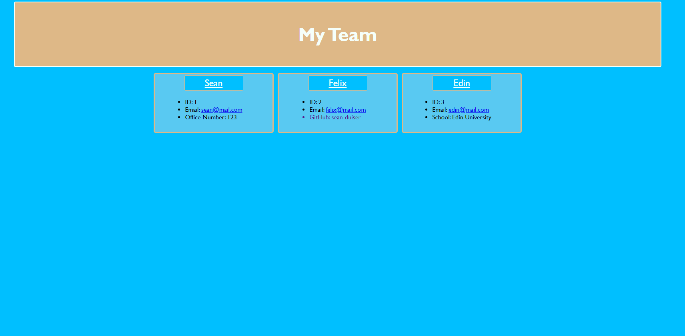

# team-profile-gen

## Description
This program is used to generate a team profile page consisting of a manager and any number of engineers and interns. Key information about each team member will be displayed.

## Visuals

## Usage
To use this program, use the command line command "node index.js". Complete the prompts as directed and when you're finished, select the "Finish Building My Team" option from the menu. At this point an HTML file will be dynamically created inside of the dist folder. Open that file and use alt+b to open the page in a browser. The user will be presented with a stylized page displaying all of the employees and employee information they just input.

## Contributors
Sean Duiser
[github.com/sean-duiser](https://github.com/Sean-Duiser);
sean.duiser.develop@gmail.com